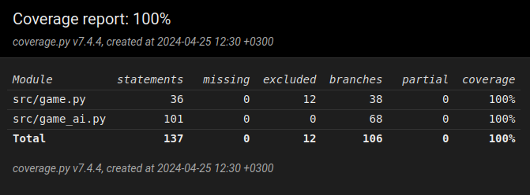

# Testausdokumentti

## Testikattavuus



## Testit

### Mitä on testattu ja miten

#### Pelin toimintalogiikka:

- Pelilaudan luominen **create_board**-funktiota testataan varmistamalla, että se luo oikean kokoisen pelilaudan.

- Pelinappulan asettaminen **place_piece**-funktiota testataan varmistamalla, että nappula asetetaan oikeaan paikkaan.

- Seuraavan vapaan rivin löytäminen **next_free_row**-funktiota testataan varmistamalla, että funktio palauttaa oikean rivin.

- Syötteen kelvollisuuden tarkistaminen **check_placement**-funktiota testataan varmistamalla, että kelvolliset ja kelvottomat syötteet tunnistetaan oikein.

- Pelin loppumisen tarkistaminen **check_game_end**-funktiota testataan varmistamalla, että voitto havaitaan oikein.

- Tyhjien paikkojen tarkistaminen **check_free_spaces**-funktiota testataan varmistamalla, että funktio palauttaa oikean määrän tyhjiä paikkoja.

#### Tekoälyn toimintalogiikka:

- Alueen arvon laskeminen **check_value**-funktiota testataan varmistamalla, että arvo lasketaan oikein.

- Pelilaudan arvon laskeminen **board_value**-funktiota testataan varmistamalla, että laudan arvo lasketaan oikein.

- Minimax-algoritmin toiminta **minimax**-funktiota testataan varmistamalla, että algoritmi palauttaa odotetun siirron ja arvon.

- Iteratiivinen syveneminen **iterative_deepening**-funktiota testataan varmistamalla, että funktio palauttaa odotetun siirron.

## Testien syötteet

Testit on suoritettu syötteillä jotka täyttävät testikattavuuden. Syötteitä ovat muun muassa erilaiset pelitilanteet, eri pelilaudat sekä mahdolliset käyttäjän syötteet. Testi syötteitä voisi olla lisää, sillä vaikka tämän hetkisillä syötteillä saavutetaan täydellinen testikattavuus eivät ne ole kuitenkaan kovin monimutkaisia.

## Testien suoritus

Suorita testit komennolla

```bash
poetry run invoke test
```

Aja testikattavuusraportti komennolla
```bash
poetry run invoke coverage
```